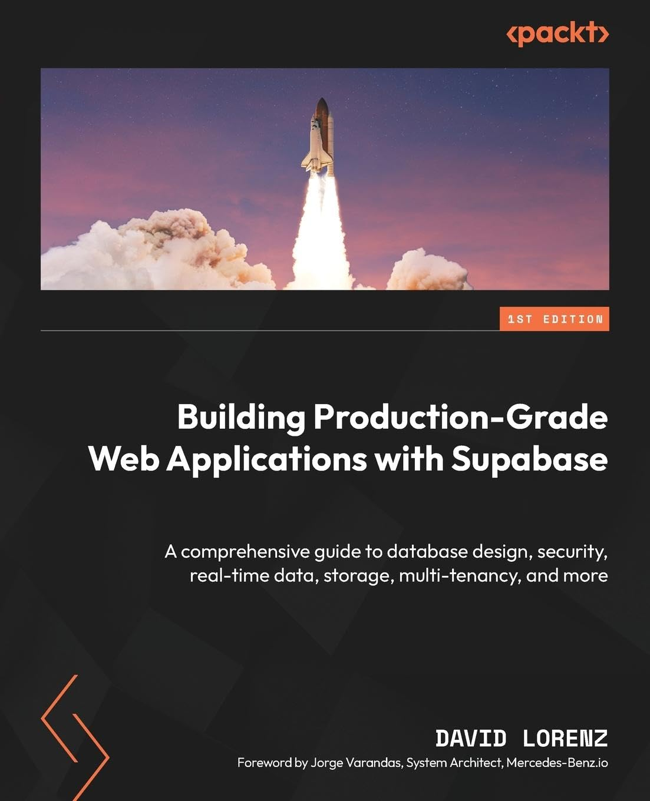

# cdApp - Multi-tenant Colombian CDA (Centro de Diagnóstico Automotor - Automotive Diagnostic Center) admin tool

**cdApp** is a sophisticated, production-grade multi-tenant administration platform specifically engineered for Colombian Automotive Diagnostic Centers (CDAs). Built as a complete operational system, it manages the entire workflow of a diagnostic center—from initial vehicle intake and diagnostics to final diagnostic, technical reports, and customer management, all while maintaining strict data isolation between different tenant organizations. The application leverages a modern, edge-ready architecture with Next.js 16 and Supabase to deliver real-time collaboration, role-based access control, and a seamless user experience that adapts to the unique regulatory and operational requirements of the Colombian automotive industry.

Developed to demonstrate mastery of complex, real-world software engineering challenges, #cdApp showcases a robust implementation of domain-driven design within a multi-tenant ecosystem. The system handles critical business logic such as automated diagnostic report generation (RTM), digital signature capture, technician assignment with availability tracking, and dynamic PDF report creation using **@react-pdf/renderer**. By combining cutting-edge frontend technologies with a scalable backend infrastructure—including PostgreSQL partitioning, Row Level Security (RLS) for tenant isolation, and Supabase Realtime for instant updates—this project exemplifies how to build, deploy, and maintain a secure, high-performance enterprise application ready for the demands of a modern automotive service network.

---

## 🌎 Language

| | |
| :--- | :--- |
| **Available Language** | **🇨🇴 Español (Colombia)** |
| **English Version** | ❌ Not available |
| **Interface** | 100% in Spanish |
| **Documentation** | 🇨🇴 Spanish |

> **ℹ️ This application is exclusively designed for the Colombian market and is only available in Spanish.**

---

## 🔗 Quick Links

### 🌐 **Main Application**

### 🎯 **Demo Access**

---

---

## 🛠️ Tools Used

- **🚀 Framework:** Next.js 16 (App Router) with React 19, utilizing Server Components, Streaming (Suspense), and ISR for optimal performance and SEO.
- **🗄️ Database:** PostgreSQL on **Supabase** with logical partitioning, RLS policies for multi-tenant isolation, and migrations managed via CLI.
- **⚡ Real-time & Collaboration:** **Supabase Realtime** (WebSockets) for live data updates across the platform.
- **📊 UI/UX:** **Shadcn/ui** components, **Tailwind CSS** with theming support (`next-themes`), **Framer Motion** for smooth animations, and **Embla Carousel** for interactive galleries.
- **📝 Forms & Validation:** **Zod** for schema validation, ensuring data integrity across complex forms.
- **📄 Document Generation:** **@react-pdf/renderer** for generating high-quality, dynamic diagnostic reports and **ExcelJS** for data export.
- **✍️ Digital Signatures:** **@uiw/react-signature** for capturing technician and customer signatures natively in the browser.
- **📊 Data Visualization & Tables:** **Recharts** for interactive analytics dashboards and **TanStack Table** for powerful, feature-rich data grids.
- **📦 State & Data Management:** **TanStack Query** for efficient server-state management, caching, and synchronization.
- **🖼️ Image Optimization:** **Sharp** for server-side image processing and dynamic resizing on the edge.
- **🛡️ Security:** Server-Side Rendering (SSR) authentication with Supabase, custom **JWT Claims**, and strict **RLS** policies.
- **📧 Emails:** **Resend** for transactional email delivery.
- **🌐 Infrastructure:** Deployed on **Vercel** with a Supabase backend, utilizing Edge functions and middleware for intelligent request routing.

---

## 🚀 Main Features

### 🏢 Multi-tenant Architecture & Personalized Experience

- **🌐 Tenant-Specific Landing Pages:** Each organization (CDA) gets a fully customizable landing page with its own branding, domain, and personalized content, providing a unique identity for every diagnostic center.
- **👤 Multi-Profile User System:** Four distinct professional roles (Receptionist, Administrative Assistant, Technical Director, and Administrator) can be assigned to users, with the flexibility to grant multiple profiles to a single user, enabling granular access control and workflow specialization.
- **⚡ Real-time Data Synchronization:** Leverages **Supabase Realtime** to provide instant updates across the platform, ensuring all users have the latest information on vehicle entries, diagnostic results, and administrative actions.

### 📋 Digital Vehicle Inspection & Regulatory Compliance

- **📝 ISO-17020 Compliant Digital Entry Order:** Creates a fully digital entry order for automotive diagnostic centers, adhering strictly to the ISO-17020 standard for inspection bodies, including structured data capture and audit trails.
- **🚗 Automatic RUNT Data Extraction:** Seamlessly integrates with the Colombian RUNT (Registro Único Nacional de Tránsito) to automatically fetch and populate vehicle data, eliminating manual entry errors and saving valuable time.
- **⚠️ Proactive Vehicle Alert System:** Automatically flags vehicles with a technical-mechanical inspection (Revisión Técnico-Mecánica) validity expiring within 10 days, enabling proactive customer outreach and service scheduling.

### 💰 Financial Management & Transaction Processing

- **💵 PIN Data Capture & Collection:** Facilitates the capture of PIN (Pago de Ingreso - Entry Fee) data and financial collection directly within the Administrative Assistant profile, streamlining the payment process for diagnostic services.
- **📊 Results Recording & Certification:** Enables the Technical Director to officially record the final diagnostic result (Approved or Rejected), and capture the consecutive FUR (Formulario Único de Revisión - Unique Inspection Form) and RTM (Revisión Técnico-Mecánica) numbers, creating an immutable record.

### 📈 Administration, Analytics & Reporting

- **📉 Advanced Analytics & Management Dashboard:** Provides the Administrator with a powerful dashboard featuring interactive analytics, key performance indicators (KPIs), and a comprehensive review system for managing complaints and appeals.
- **📧 Automated Email Reminders:** Integrates with **Resend** to automatically send timely email reminders to customers about their upcoming technical-mechanical inspections, improving customer retention and compliance.
- **📊 Excel Data Export:** Generates detailed **Excel** reports of all entry orders for data analysis, offline auditing, and advanced record-keeping.
- **📄 Professional PDF Report Generation:** Dynamically generates comprehensive, secure **PDF** reports of the digital entry order, complete with legally binding digital signature capture for the client, inspector, and technical director using **@react-pdf/renderer**.

### 🛠️ Document Management & Operational Control

- **📄 Versioned Template System:** Features a sophisticated system for creating, managing, and versioning entry order templates, ensuring full traceability of documentation as required by ISO-17020 for quality management systems.
- **✍️ Native Digital Signature Capture:** Integrates a native, browser-based digital signature pad for inspectors, technical directors, and clients, enabling secure and verifiable electronic signatures on all official documents.
- **📎 Document & Attachment Management:** Includes a robust system for uploading, storing, and linking supporting documents, images, and attachments to each entry order using **Supabase Storage**.

### 🔐 Security, Performance & Resilience

- **🛡️ Row-Level Security (RLS):** Enforces strict, multi-tenant database policies to ensure complete data isolation between organizations. Users can only access data belonging to their tenant and their specific role.
- **⚡ Edge-Ready & Optimized:** Deployed on **Vercel** with edge functions and middleware for optimal performance, delivering low-latency responses worldwide.
- **📦 Intelligent State Management:** Utilizes **TanStack Query** for efficient server-state caching and synchronization, ensuring a responsive UI and reduced server load.
- **📱 100% Responsive UI:** Built with **Tailwind CSS** and **Shadcn/ui**, the interface is fully responsive and optimized for a seamless experience across all devices—from desktops to tablets and smartphones.
- **🎨 Modern, Accessible Components:** All UI components are developed with accessibility (A11y) in mind, following the **WAI-ARIA** standards and providing a professional, consistent look and feel.

### 💡 Additional Advanced Capabilities

- **🔔 Real-time Notifications:** Keeps all users informed with real-time updates on entry order status changes, new assignments, and system alerts.
- **🗄️ Scalable Database Partitioning:** Employs **PostgreSQL Partitioning** on key tables by `tenant_id` to ensure consistent high performance and efficient data management, even with millions of records.
- **🔄 Optimistic UI Updates:** Implements optimistic UI patterns for instant feedback on user actions, significantly improving the perceived speed and user experience.
- **📸 Server-Side Image Processing:** Uses **Sharp** for dynamic image resizing and optimization on the edge, balancing image quality with bandwidth efficiency.

---

## 🎯 Core Features (Functional Capabilities)

These are the specific **business functionalities** the system provides:

### 📋 Entry Order Management

- **Digital Entry Order Creation:** Full digital workflow for vehicle intake respecting ISO-17020 standards, with structured data capture and audit trails.
- **Automatic RUNT Data Extraction:** Integration with Colombian RUNT to auto-fetch vehicle data, eliminating manual entry and errors.
- **Vehicle Alert System:** Proactive flagging of vehicles with technical-mechanical inspection expiring within 10 days.
- **Result Recording:** Technical Director can officially record Approved/Rejected results and capture consecutive FUR and RTM numbers.

### 💰 Administrative & Financial Operations

- **PIN Data Capture & Collection:** Administrative Assistant profile handles PIN (Pago de Ingreso) data and financial collection for diagnostic services.
- **Excel Report Generation:** Export detailed entry order reports in Excel format for data analysis and offline auditing.

### 📄 Document & Template Management

- **Versioned Template System:** Create, manage, and version entry order templates with full ISO-17020 traceability for documentation.
- **PDF Report Generation:** Dynamically generate professional PDFs of digital entry orders using @react-pdf/renderer.
- **Digital Signature Capture:** Native browser-based signature pad for client, inspector, and technical director with secure electronic signatures.
- **Document Attachments:** Upload, store, and link supporting documents and images to each entry order using Supabase Storage.

### 📊 Administration & Analytics

- **Advanced Analytics Dashboard:** Administrator dashboard with interactive KPIs, analytics, and comprehensive review of complaints and appeals.
- **Automated Email Reminders:** Resend integration for timely customer reminders about upcoming technical-mechanical inspections.
- **Real-time Notifications:** Instant updates on entry order status changes, assignments, and system alerts.

### 👥 User Management

- **Granular Access Control:** Role-based permissions system with four distinct profiles (Receptionist, Administrative Assistant, Technical Director, Administrator).
- **Multi-profile Assignment:** Users can hold multiple roles simultaneously, enabling flexible workflow management.

---

## Theory Applied to Practice from the Book

- [Building Production-Grade Web Applications with Supabase: A comprehensive guide to database design, security, real-time data, storage, multi-tenancy, and more by David Lorenz](https://www.amazon.com/Building-Production-Grade-Applications-Supabase-comprehensive/dp/1837630682)

---

## DataBase Schema

```mermaid
erDiagram
    %% ==========================================
    %% Core Multi-tenant Entities
    %% ==========================================
    tenants {
        uuid id PK
        text name
        text domain "UNIQUE"
        text slug "UNIQUE"
        text logo_url
        timestamptz created_at
        timestamptz updated_at
    }

    tenant_permissions {
        uuid id PK
        uuid tenant_id FK
        uuid service_user_id FK
        enum role "recepcionista,auxiliar_administrativo,director_tecnico,administrador"
        timestamptz created_at
        timestamptz updated_at
    }

    tenant_modules {
        uuid id PK
        uuid tenant_id FK
        uuid module_id FK
        boolean is_enabled
        timestamptz created_at
        timestamptz updated_at
    }

    tenant_credits {
        uuid id PK
        uuid tenant_id FK "UNIQUE"
        integer cupo_fupas
        integer cupo_certificados
        timestamptz created_at
        timestamptz updated_at
    }

    %% ==========================================
    %% User & Authentication Entities
    %% ==========================================
    auth_users {
        uuid id PK "Supabase Auth"
    }

    service_users {
        uuid id PK
        uuid auth_user_id FK "UNIQUE"
        text full_name
        text document_type
        text document_number "UNIQUE with document_type"
        boolean is_active
        text signature_base64
        timestamptz created_at
        timestamptz updated_at
    }

    %% ==========================================
    %% Module System
    %% ==========================================
    modules {
        uuid id PK
        text code "UNIQUE"
        text name
        text description
        boolean is_active
        timestamptz created_at
        timestamptz updated_at
    }

    %% ==========================================
    %% Person & Vehicle Entities
    %% ==========================================
    personas {
        uuid id PK
        uuid tenant_id FK
        enum tipo_documento
        text numero_documento "UNIQUE with tenant_id,tipo_documento"
        text nombre_completo
        text telefono
        text correo
        text direccion
        text actividad_economica
        text origen_fondos
        boolean es_persona_publicamente_expuesta
        timestamptz created_at
        timestamptz updated_at
        timestamptz deleted_at
    }

    vehicles {
        uuid id PK
        uuid tenant_id FK
        text placa "UNIQUE with tenant_id"
        text marca
        text linea
        integer modelo
        text color
        enum tipo_vehiculo
        text clase
        text combustible
        integer cilindrada
        boolean blindaje
        integer capacidad_pasajeros
        boolean es_ensenanza
        uuid propietario_actual_id FK
        enum tipo_servicio_vehiculo
        boolean es_extranjero
        timestamptz created_at
        timestamptz updated_at
        timestamptz deleted_at
    }

    %% ==========================================
    %% Entry Order Template System
    %% ==========================================
    order_template {
        uuid id PK
        uuid tenant_id FK
        text template_name
        integer version "UNIQUE with tenant_id,document_code"
        boolean is_active
        date document_date
        text document_code "UNIQUE with tenant_id,version"
        text logo_url
        text base_contract_text
        uuid created_by FK
        timestamptz created_at
        timestamptz updated_at
        timestamptz deleted_at
    }

    order_template_conditions {
        uuid id PK
        uuid tenant_id FK
        uuid order_template_id FK
        text label
        boolean is_special
        text special_condition_label
        enum default_value
        timestamptz created_at
        timestamptz updated_at
        timestamptz deleted_at
    }

    order_template_signatures {
        uuid id PK
        uuid tenant_id FK
        uuid order_template_id FK
        text representative_type
        text signature_label
        timestamptz created_at
        timestamptz updated_at
        timestamptz deleted_at
    }

    order_template_signature_conditions {
        uuid id PK
        uuid tenant_id FK
        uuid order_template_signature_id FK
        text declaration_text
        timestamptz created_at
        timestamptz updated_at
        timestamptz deleted_at
    }

    %% ==========================================
    %% Entry Order Core Entity (Main Business Entity)
    %% ==========================================
    entry_orders {
        uuid id PK
        uuid tenant_id FK
        integer consecutivo "UNIQUE with tenant_id"
        timestamptz fecha
        uuid vehiculo_id FK
        uuid propietario_id FK
        uuid cliente_id FK
        uuid funcionario_id FK
        uuid plantilla_id FK
        text kilometraje
        boolean es_reinspeccion
        text observaciones
        enum estado_orden "abierta,en_proceso,cerrada,cancelada"
        date soat_vencimiento_snapshot
        text gas_numero_snapshot
        date gas_vencimiento_snapshot
        enum service_type "RTM,CE,CERTIFICADO"
        text vehiculo_placa_snapshot
        text vehiculo_marca_snapshot
        text vehiculo_linea_snapshot
        integer vehiculo_modelo_snapshot
        text vehiculo_color_snapshot
        enum vehiculo_tipo_snapshot
        text vehiculo_clase_snapshot
        text vehiculo_combustible_snapshot
        integer vehiculo_cilindrada_snapshot
        boolean vehiculo_blindaje_snapshot
        integer vehiculo_capacidad_pasajeros_snapshot
        boolean vehiculo_es_ensenanza_snapshot
        enum vehiculo_tipo_servicio_snapshot
        boolean vehiculo_es_extranjero_snapshot
        text propietario_tipo_documento_snapshot
        text propietario_numero_documento_snapshot
        text propietario_nombre_snapshot
        text propietario_telefono_snapshot
        text propietario_email_snapshot
        text propietario_direccion_snapshot
        text cliente_tipo_documento_snapshot
        text cliente_numero_documento_snapshot
        text cliente_nombre_snapshot
        text cliente_telefono_snapshot
        text cliente_email_snapshot
        text cliente_direccion_snapshot
        text funcionario_tipo_documento_snapshot
        text funcionario_numero_documento_snapshot
        text funcionario_nombre_snapshot
        text funcionario_firma_base64_snapshot
        text oficina_pin "UNIQUE with tenant_id (no reinspeccion)"
        numeric oficina_pago
        text oficina_consecutivo_factura "UNIQUE with tenant_id (no reinspeccion)"
        enum oficina_tipo_pago
        boolean se_compro_soat
        text resultado_revision
        text consecutivo_fur "UNIQUE with tenant_id"
        text consecutivo_rtm "UNIQUE with tenant_id"
        uuid id_reprobado FK
        uuid id_orden_reinspeccion FK
        timestamptz fecha_limite_reinspeccion
        text oficina_num_aprobacion
        text director_tecnico_tipo_documento_snapshot
        text director_tecnico_numero_documento_snapshot
        text director_tecnico_nombre_snapshot
        text director_tecnico_firma_base64_snapshot
        timestamptz created_at
        timestamptz updated_at
        timestamptz deleted_at
    }

    %% ==========================================
    %% Entry Order Supporting Entities
    %% ==========================================
    order_signatures {
        uuid id PK
        uuid tenant_id FK
        uuid entry_order_id FK
        uuid template_signature_id FK
        text signature_url
        timestamptz created_at
    }

    order_condition_results {
        uuid id PK
        uuid tenant_id FK
        uuid entry_order_id FK
        uuid template_condition_id FK
        enum value
        timestamptz created_at
        timestamptz updated_at
    }

    entry_order_tire_pressures {
        uuid id PK
        uuid tenant_id FK
        uuid entry_order_id FK
        integer eje
        text posicion "izquierda,derecha,centro,izquierda_interior,derecha_interior,repuesto"
        numeric presion_encontrada
        numeric presion_ajustada
        timestamptz created_at
        timestamptz updated_at
        timestamptz deleted_at
    }

    %% ==========================================
    %% Service Requirements (PQRS)
    %% ==========================================
    service_requirements {
        uuid id PK
        uuid tenant_id FK
        text sender_name
        text sender_email
        text sender_phone
        text placa
        text description
        text requirement_type "peticion,queja,apelacion,felicitacion"
        text status "pendiente,en_revision,resuelto,nueva_revision,finalizado"
        timestamptz created_at
        timestamptz updated_at
    }

    %% ==========================================
    %% SARLAFT Module (Anti-Money Laundering)
    %% ==========================================
    sarlaft_module {
        uuid id PK
        uuid tenant_id FK
        uuid entry_order_id FK
        text person_type "customer,owner"
        text placa_snapshot
        text nombre_completo_snapshot
        text tipo_documento_snapshot
        text numero_documento_snapshot
        text actividad_economica_snapshot
        text origen_fondos_snapshot
        boolean es_persona_publicamente_expuesta_snapshot
        timestamptz created_at
        timestamptz updated_at
        timestamptz deleted_at
    }

    %% ==========================================
    %% Materialized View
    %% ==========================================
    mv_reportes_diarios {
        date fecha
        uuid tenant_id
        text service_type
        enum resultado_revision
        text vehiculo_tipo_snapshot
        boolean se_compro_soat
        integer cantidad
    }

    %% ==========================================
    %% Relationship Definitions
    %% ==========================================
    
    %% Tenant Relationships
    tenants ||--o{ tenant_permissions : "Has (1:N)"
    tenants ||--o{ tenant_modules : "Has (1:N)"
    tenants ||--o{ tenant_credits : "Has (1:1)"
    tenants ||--o{ vehicles : "Owns (1:N)"
    tenants ||--o{ personas : "Has (1:N)"
    tenants ||--o{ order_template : "Manages (1:N)"
    tenants ||--o{ order_template_conditions : "Defines (1:N)"
    tenants ||--o{ order_template_signatures : "Defines (1:N)"
    tenants ||--o{ order_template_signature_conditions : "Defines (1:N)"
    tenants ||--o{ entry_orders : "Has (1:N)"
    tenants ||--o{ order_signatures : "Has (1:N)"
    tenants ||--o{ order_condition_results : "Has (1:N)"
    tenants ||--o{ entry_order_tire_pressures : "Has (1:N)"
    tenants ||--o{ service_requirements : "Receives (1:N)"
    tenants ||--o{ sarlaft_module : "Has (1:N)"

    %% User Relationships
    auth_users ||--|| service_users : "Maps to (1:1)"
    service_users ||--o{ tenant_permissions : "Has (1:N)"
    service_users ||--o{ order_template : "Creates (1:N)"
    service_users ||--o{ entry_orders : "Registers as funcionario (1:N)"

    %% Module Relationships
    modules ||--o{ tenant_modules : "Assigned to (1:N)"

    %% Person & Vehicle Relationships
    personas ||--o{ vehicles : "Owns (1:N)"
    personas ||--o{ entry_orders : "Is propietario (1:N)"
    personas ||--o{ entry_orders : "Is cliente (1:N)"

    %% Vehicle Relationships
    vehicles ||--o{ entry_orders : "Inspected in (1:N)"

    %% Template Relationships
    order_template ||--o{ order_template_conditions : "Contains (1:N)"
    order_template ||--o{ order_template_signatures : "Contains (1:N)"
    order_template ||--o{ entry_orders : "Used in (1:N)"
    order_template_signatures ||--o{ order_template_signature_conditions : "Has (1:N)"
    order_template_signatures ||--o{ order_signatures : "Used in (1:N)"

    %% Entry Order Relationships
    entry_orders ||--o{ order_signatures : "Has (1:N)"
    entry_orders ||--o{ order_condition_results : "Has (1:N)"
    entry_orders ||--o{ entry_order_tire_pressures : "Has (1:N)"
    entry_orders ||--o{ sarlaft_module : "Has (1:1)"
    entry_orders ||--o{ entry_orders : "Reinspeccion (1:1)" 
```

### 🔑 Key Design Points

**Multi-tenant Architecture:**

- `tenants` is the root entity. All tables include `tenant_id` for complete data isolation via RLS policies.

**User & Role Management:**

- `service_users` maps 1:1 with Supabase Auth (`auth_users`)
- `tenant_permissions` enables multiple roles per user per tenant (Receptionist, Administrative Assistant, Technical Director, Administrator)

**Template System (ISO-17020 Compliance):**

- `order_template` with versioning and active/inactive states for full document traceability
- `order_template_conditions` for customizable inspection checklists
- `order_template_signatures` and `order_template_signature_conditions` for legally binding signature requirements

**Entry Order Management (Core Business Entity):**

- Complete digital entry order workflow with extensive snapshot data to preserve historical accuracy
- `entry_orders` includes snapshots of vehicle, owner, client, and inspector data at time of order creation
- Tracks SOAT and GAS (gas certificate) validity
- Supports re-inspection workflow with `es_reinspeccion`, `id_reprobado`, and `id_orden_reinspeccion`
- Unique constraints on `consecutivo`, `consecutivo_fur`, and `consecutivo_rtm` per tenant

**Financial & Administrative Tracking:**

- `oficina_pin`, `oficina_pago`, `oficina_consecutivo_factura` for payment tracking
- `oficina_tipo_pago` enum for payment method
- Unique constraints on PIN and invoice number for non-reinspection orders

**Tire Pressure Management:**

- `entry_order_tire_pressures` tracks tire pressure readings per axle and position
- Supports multiple axle configurations with position validation

**Service Types:**

- `service_type_enum`: RTM (Technical-Mechanical Inspection), CE, CERTIFICADO

**Anti-Money Laundering (SARLAFT):**

- `sarlaft_module` captures snapshot data for compliance at time of entry order creation

**Service Requirements (PQRS):**

- `service_requirements` handles Peticiones, Quejas, Reclamos, Sugerencias with full lifecycle tracking

**Analytics & Reporting:**

- `mv_reportes_diarios` materialized view for daily operational metrics

**Modular System:**

- `modules` and `tenant_modules` enable feature flagging per tenant for flexible monetization

## 📄 License

| | |
| :--- | :--- |
| **License Type** | **Source-Available (Commons Clause)** |
| **Commercial Use** | ❌ Restricted without commercial agreement |
| **Competing Services** | 🚫 Prohibited |
| **View & Modify Code** | ✅ Permitted |
| **Personal/Educational Use** | ✅ Permitted |
| **OSI-Approved Open Source** | ❌ No |

---

### 📢 **Important Notice**

> **This source code is made publicly available for viewing, learning, and educational purposes only.**
>
> **Commercial use, offering competing services, or any use that derives substantial value from the software's functionality is strictly prohibited without a separate commercial agreement.**

---

### 🔒 License Terms

This project is licensed under the **Commons Clause License Condition v1.0** applied on top of a permissive base license.

**You MAY:**

- View, study, and modify the source code
- Use the software for personal, academic, or research purposes
- Fork and experiment with the code for non-commercial purposes

**You MAY NOT:**

- **Sell** the software or any product/service whose primary value derives from it.
- Offer competing services (SaaS, hosting, or consulting) based on this software.
- Use the software for any commercial purpose without a separate commercial agreement from the licensor.

**Why this license?**

This approach balances transparency for the developer community with protecting the intellectual property and business model of the private company behind the project. While the code remains visible for recruiters and students to evaluate, it prevents competitors from using the work to create commercial alternatives without permission.

---

### 📧 Commercial Licensing

For commercial use, competing service offerings, or any use not covered by this license, please contact:

**Email:** [spjhon@gmail.com](mailto:spjhon@gmail.com)

---

*⚠️ This license is not OSI-approved open source. It is a source-available license designed to protect commercial interests while maintaining code transparency.
